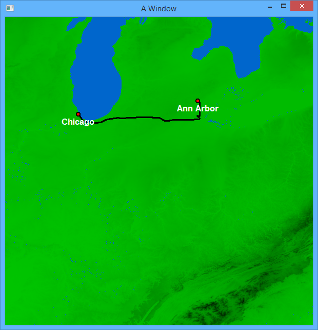

# MapTraversal
Project for class: Algorithms in C++. 

This was the final project for a C++ programming course at the University of Miami. It combines many concepts I have learned through my classes in software engineering, as well as some other topics I have learned about on my own:

- Designing and organizing a large  code base from scratch. 
- Managing large database files and reading into corresponding data structures (hash table and vectors).
- Graph traversal techniques to find the shortest path.
- Graphics library usage to draw images. 
- Various techniques for well-structured code: header files, using debugger, inheritance

Screenshot of the working project drawing the path from Chicago to Ann Arbor.

Here are the driving instructions that are printed.

It traverses across the country and displays an appropriately sized map tile.

